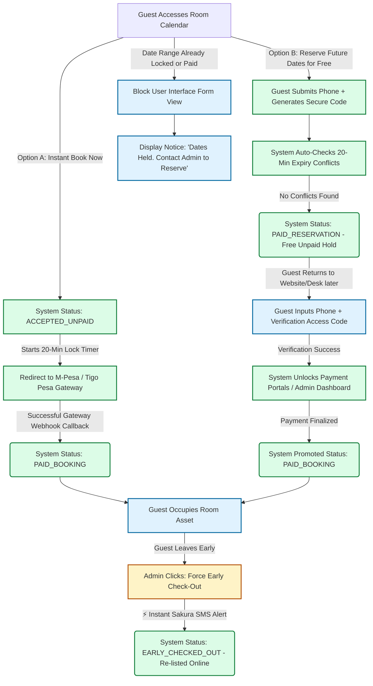

# 📄 SYSTEM ARCHITECTURE & LOGIC SPECIFICATION DOCUMENT
**To:** Hotel Executive Administration & Technical Operations  
**Project:** Automated Guest Management & Smart Notification Booking System  
**Framework Architecture:** Python Django MVT (Model-View-Template)  
**Communications Backbone:** Sakura SMS Unified API Gateway (Tanzanian Local Routing)

---

### 1. Executive Summary
This document specifies the structural data flow, validation rules, and automated notification triggers for the hotel's digital booking lifecycle. The architecture introduces a **Dual-Intent Booking and Deferred Reservation Pipeline** engineered to support both instant online payments and free, pin-protected date holds. By deploying automated race-condition database locks alongside early-checkout release switches, the platform guarantees 100% room inventory efficiency while achieving a **97% telecommunications cost reduction** using local Tanzanian routing via the Sakura SMS gateway.

---

### 2. Core Functional Pipelines (The Flow Matrix)



#### Pathway A: Instant Online Booking
*   **Intake & Holding Lock:** The customer selects a room asset online. The system instantly marks the row as `accepted_unpaid` and initiates a strict **20-minute holding clock**.
*   **Payment & Verification:** The page routes the customer directly to a local mobile money aggregator (M-Pesa/Tigo Pesa/Airtel Money). If a successful payment signature is received before the 20 minutes expire, the system updates the state to `paid_booking` and releases automatic digital receipts via Sakura SMS. If the timer hits zero without payment, the hold drops automatically.

#### Pathway B: Deferred Free Reservation & Verification Loop
*   **The Deferred Intake:** A user wants to lock a room for a specific future date without paying immediately. They input their name and phone number. The system verifies no conflicts exist, generates a unique **6-digit Access PIN**, and locks the date range under the status `paid_reservation` (Free Active Hold).
*   **The Overlap Guard:** If another public visitor attempts to view or book this exact room for the same dates, the checkout forms are blocked. The interface automatically renders a warning notification: **"This date range is securely held. Please contact Hotel Administration at +255... to coordinate standby placement."**
*   **The Re-Verification Claim:** When the guest returns online or approaches the physical front desk to pay for their stay, they input their original phone number and Access PIN. The backend validates their credentials, unlocks the payment gateway, and securely transitions the room into the standard billing flow.

#### Pathway C: Early Checkout Lifecycle Breakout
*   **The Emergency Dynamic Re-Listing:** If a guest checked into a room leaves the property before their scheduled checkout date, the administrator can access the row and click **"Force Early Check-Out"**.
*   **Inventory Re-Listing:** The database breaks out of all scheduled future cron alerts, flags the state to `early_checked_out`, and **instantly returns the room asset back to the public online room availability matrix**, allowing a new paying customer to reserve the room online immediately.

---

### 3. Comprehensive Data Lifecycle States

| Database State Vector | Transition Vector Type | Operational Meaning & Safeguard Rules |
| :--- | :--- | :--- |
| `accepted_unpaid` | **Automatic Instantly** | Temporary payment hold configuration. Expires automatically if webhooks fail to return within 20 minutes. |
| `paid_reservation` | **Automatic Free Option** | Free deferred hold. Assets are locked from public calendars. Requires user's phone + unique PIN for future booking/payment unlock. |
| `paid_booking` | **Automated / Manual Override** | Payment verified via online mobile money webhook or cash desk button activation. Triggers long-term chrono notifications. |
| `early_checked_out` | **Manual Admin Action** | **Emergency lifecycle breakout.** Instantly re-lists the room asset back to the live public web application inventory before schedule expiration. |
| `checked_out` | **Automatic Chrono** | Checkout parameters hit zero. Room automatically passes back to the active available public search index. |

---

### 4. Technical Blueprint: Race-Condition & Validation Engine (`views.py`)

This core controller manages automatic approval checks, prevents double payments, and handles deferred verification matches securely:

```python
from django.db import transaction
from django.utils import timezone
from datetime import timedelta
from django.http import JsonResponse
from .models import Booking, Room

def initiate_instant_booking(request):
    """
    Evaluates availability, processes automatic holds, and enforces the 'Contact Admin' notice layout.
    """
    room_id = request.POST.get('room_id')
    target_date = request.POST.get('booking_date')
    user = request.user

    try:
        with transaction.atomic():
            # Pessimistic database lock: isolates row to prevent concurrent cross-clicking
            room = Room.objects.select_for_update().get(id=room_id)
            
            # Look for active locks (Paid stays, active free reservations, or an unexpired 20-min payment hold)
            expiry_threshold = timezone.now() - timedelta(minutes=20)
            conflicting_booking = Booking.objects.filter(
                room=room,
                check_in_date=target_date
            ).filter(
                models.Q(status='paid_booking') | 
                models.Q(status='paid_reservation') | 
                models.Q(status='accepted_unpaid', created_at__gte=expiry_threshold)
            ).exists()

            if conflicting_booking:
                return JsonResponse({
                    'status': 'held',
                    'message': 'This date is currently held by another transaction. Please contact administration directly at +255712345678 to coordinate standby options.'
                }, status=409)

            # AUTOMATIC PROCESS APPROVAL:
            new_booking = Booking.objects.create(
                user=user,
                room=room,
                check_in_date=target_date,
                status='accepted_unpaid',
                created_at=timezone.now()
            )
            
            return JsonResponse({
                'status': 'accepted',
                'booking_id': new_booking.id,
                'message': 'Booking automatically approved. Payment hold active for 20 minutes.'
            }, status=201)

    except Room.DoesNotExist:
        return JsonResponse({'status': 'error', 'message': 'Room profile not found'}, status=404)
```

---

### 5. Automated Notification Architecture Framework

Communication actions are separated into two distinct pipelines to keep external network delays from slowing down front-end page load speeds:

#### ⚡ Engine Pipeline A: Event-Driven Triggers (Django Signals)
*   **Trigger 1: Automatic Reservation/Booking Hold Initiated**
    *   **SMS Body:** *"Habari! Ombi lako limeidhinishwa kiotomatiki. Kamilisha malipo ya TZS [Amount] ndani ya dakika 20 kupitia link hii ili kuthibisha chumba chako."*
*   **Trigger 2: Payment Gateway Callback / Manual Desk Approval**
    *   **SMS Body:** *"Ahsante! Malipo yako ya TZS [Amount] yamethibitishwa kikamilifu. Hifadhi ya chumba chako imekamilika rasmi. Karibu sana!"*
*   **Trigger 3: Administrative Early Checkout Forced**
    *   **SMS Body:** *"Habari, check-out yako ya mapema imekamilika kikamilifu. Mfumo umesitisha huduma za chumba chako kwa sasa. Ahsante na karibu tena!"*

#### 🕒 Engine Pipeline B: Chronological Time-Sweepers (Automated Server Cron-Jobs)
*   **Trigger 4: Scheduled Stay Reminders (Sent 24 Hours Before Check-in)**
    *   **SMS Body:** *"Kumbukumbu: Safari yako inaanza kesho! Hakikisha unakuja na Code yako au kitambulisho wakati wa kuingia (Check-in) saa [Time]. Karibu."*
*   **Trigger 5: Reservation End Warning (Sent 24 Hours Before Departure Check-out)**
